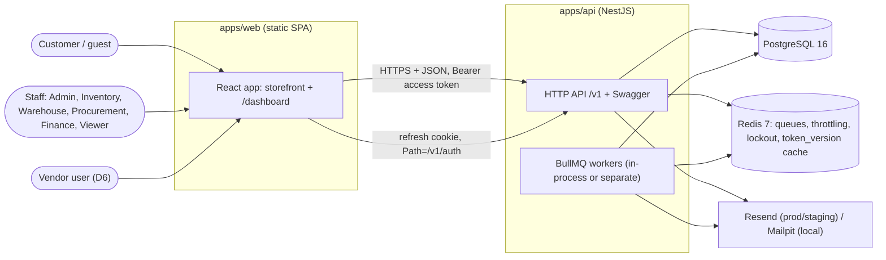
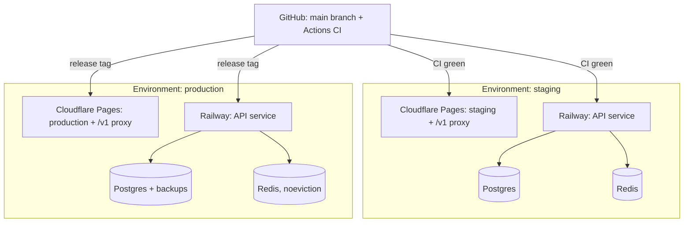
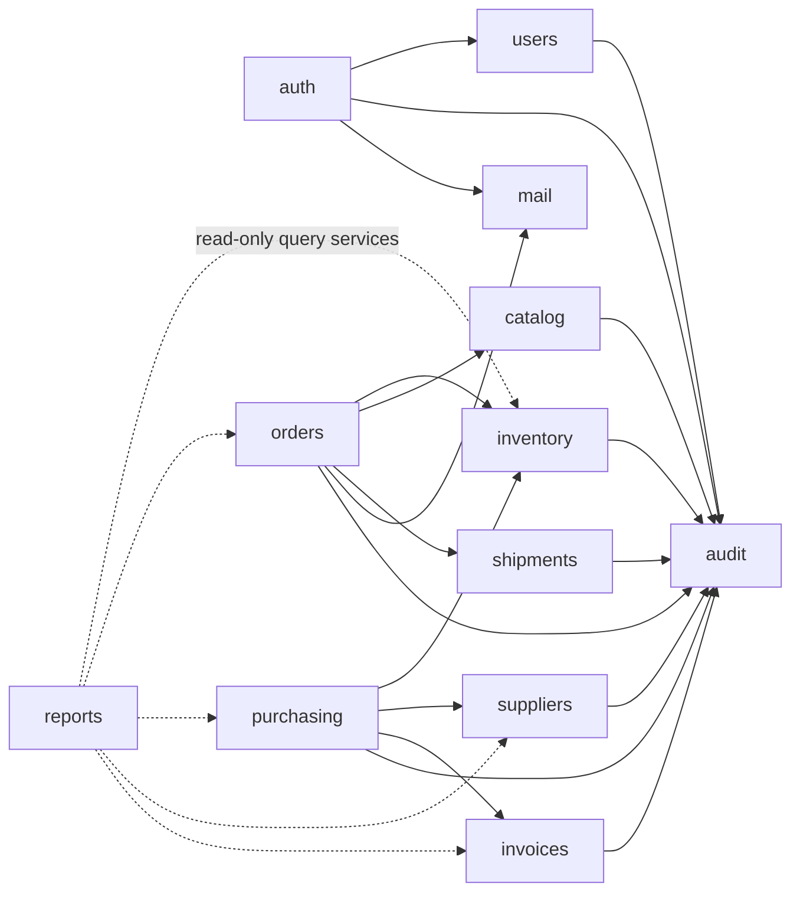
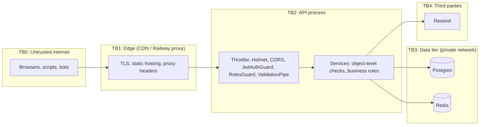

# Architecture

Topology follows D1 (interim, no domain yet): the browser talks to a single origin. Cloudflare Pages (D2) serves the SPA and proxies `/v1/*` to the Railway API, so the refresh cookie is first-party. When a domain is bought, this moves to `app.<domain>` and `api.<domain>`. Items marked *(D#)* depend on a decision in `docs/decisions.md`.

## 1. Container view

## 2. Deployment view

Rules: separate Postgres and Redis per environment; `prisma migrate deploy` runs as a release step before the new API instance takes traffic (expand/contract migrations only); two DB roles (migration owner, runtime with no UPDATE/DELETE on ledgers); Redis `maxmemory-policy noeviction` (BullMQ requirement); API behind Railway's proxy with `trust proxy` set so rate limits key on the real client IP.

## 3. Module dependency rules (enforced by ESLint boundaries)

An arrow means "may call the service of". Anything not drawn is forbidden. No module reads another module's tables directly.

Notes: `audit` and `mail` are leaf modules. `catalog` never calls `inventory` to mutate stock. `orders` reads prices from `catalog`, never from `Part` directly. `health` is standalone.

## 4. Trust boundaries

Every arrow crossing a boundary is an attack surface. See `docs/threat_model.md` for per-boundary threats and mitigations.
