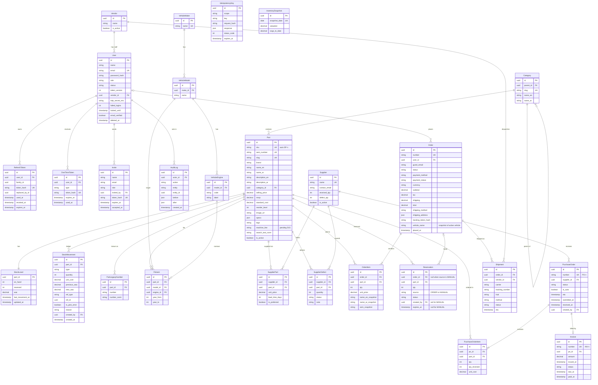

# ERD (proposed schema)

Status: **Proposed, ready for review** (all underlying decisions D3 to D14 are Accepted; see `docs/decisions.md`). Approve this file before the agent writes `schema.prisma`. Order amounts are tax-inclusive: `subtotal` includes tax, `tax` is the included portion, `total = subtotal + shipping`. The agent must not create `schema.prisma` until this file is approved.

Conventions: every table has `id uuid PK`, `created_at`, `updated_at` unless stated. `StockMovement` and `AuditLog` are append-only (`created_at` only). Money is `Decimal(12,2)`; cost and WAC are `Decimal(12,4)`. FKs default to `ON DELETE RESTRICT`. Localized fields come in `_en` / `_ar` pairs. Users are never hard-deleted (`deleted_at` plus anonymization).

## Enums

| Enum | Values |
|---|---|
| `Role` | `ADMIN INVENTORY_MANAGER WAREHOUSE_OPERATOR PROCUREMENT FINANCE VIEWER CUSTOMER VENDOR` |
| `UserStatus` | `ACTIVE SUSPENDED` (`deleted_at` marks anonymized users) |
| `MovementType` | `RECEIVE ISSUE UNFULFILLED ADJUST RETURN` (`RETURN` unused in Phase 3, D10) |
| `POStatus` | `DRAFT SUBMITTED RECEIVED CANCELLED` |
| `InvoiceStatus` | `UNPAID PAID` (`OVERDUE` computed: UNPAID and `due_at < now`) |
| `OrderStatus` | `PENDING CONFIRMED PACKED SHIPPED DELIVERED CANCELLED` |
| `PaymentMethod` | `COD` (`CARD_PENDING` removed if D19 accepted) |
| `PaymentStatus` | `UNPAID PAID REFUNDED` |
| `ReservationStatus` | `ACTIVE CONSUMED RELEASED EXPIRED` |
| `DefectStatus` | `OPEN CLOSED` (CONTEXT.md only mentions "open RMAs"; defect rate counts all defects, open RMAs counts `OPEN`) |
| `OneTimeTokenType` | `VERIFY_EMAIL RESET_PASSWORD` |

## Constraints and indexes the migration must include

- Extensions: `pg_trgm`, `pgcrypto`.
- `CHECK (on_hand >= 0 AND reserved >= 0 AND reserved <= on_hand)` on `StockLevel`.
- `CHECK (qty > 0)` on `OrderItem`, `Reservation`, `PurchaseOrderItem`.
- Unique: `(supplier_id, part_id)` on `SupplierPart`; `(scope, key)` on `IdempotencyKey`; `(part_id, model_id, engine_id, year_from, year_to)` on `Fitment`.
- GIN trigram indexes on `Part.oem_number`, `Part.name_en`, `Part.name_ar`, `Part.search_text_norm`, `PartLegacyNumber.number_norm`. `*_norm` columns hold lowercased, separator-stripped, Arabic-normalized text (diacritics removed, alef and ya variants folded).
- Btree: `Order(user_id, placed_at)`, `Order(status)`, `Reservation(status, expires_at)`, `StockMovement(part_id, created_at)`, `Invoice(status, due_at)`, `RefreshToken(family_id)`, `AuditLog(entity, entity_id)`.
- Runtime DB role: no `UPDATE` or `DELETE` on `StockMovement` and `AuditLog`.
- Open question handled in schema: a PO item can be partially received (`qty_received`), but Phase 3 `receive` endpoint may still receive in full; the column keeps the door open.
