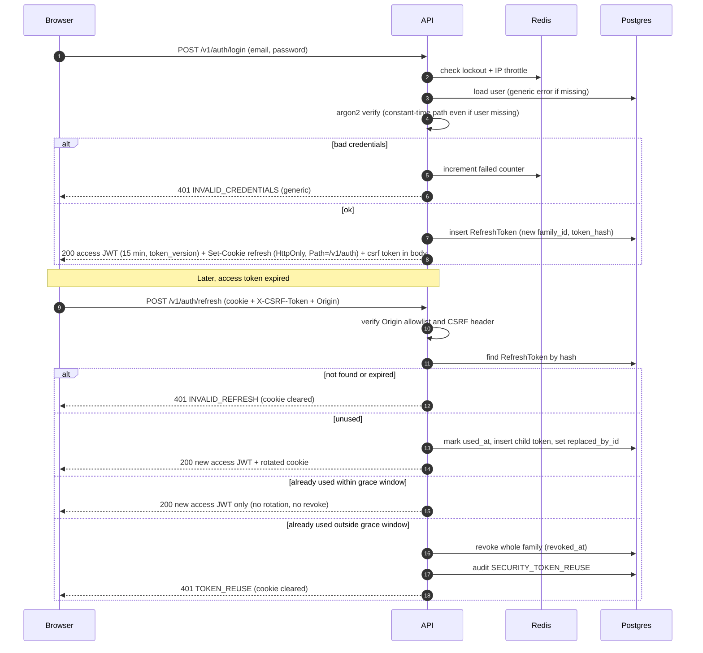
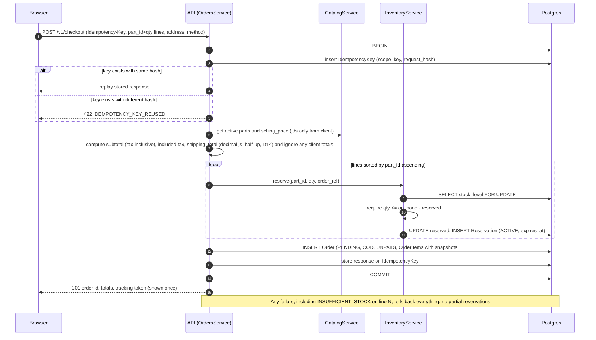
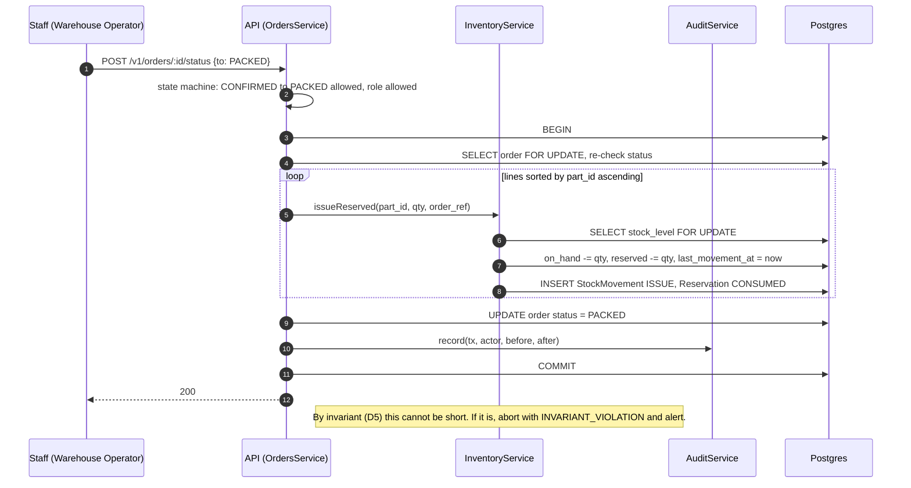
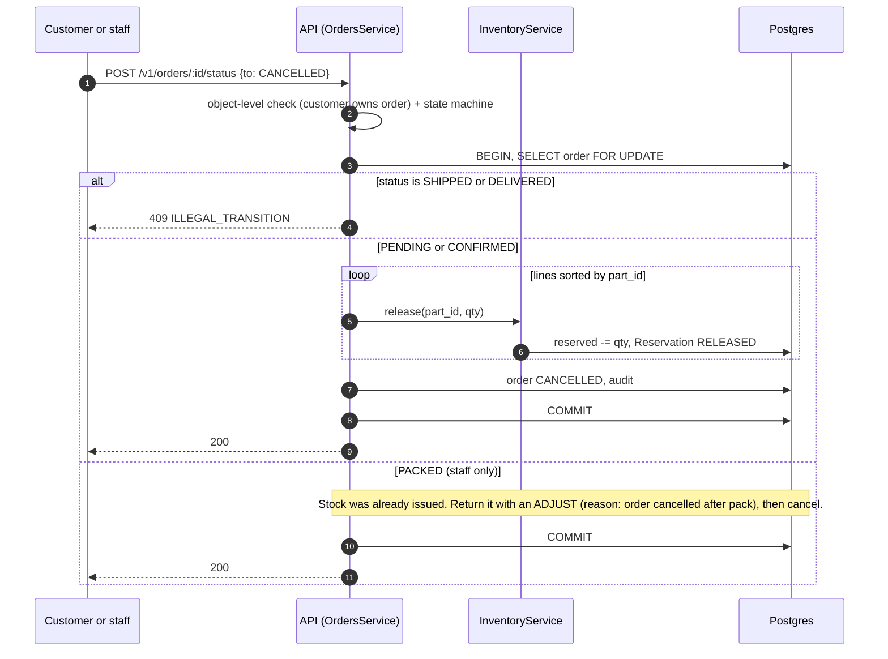
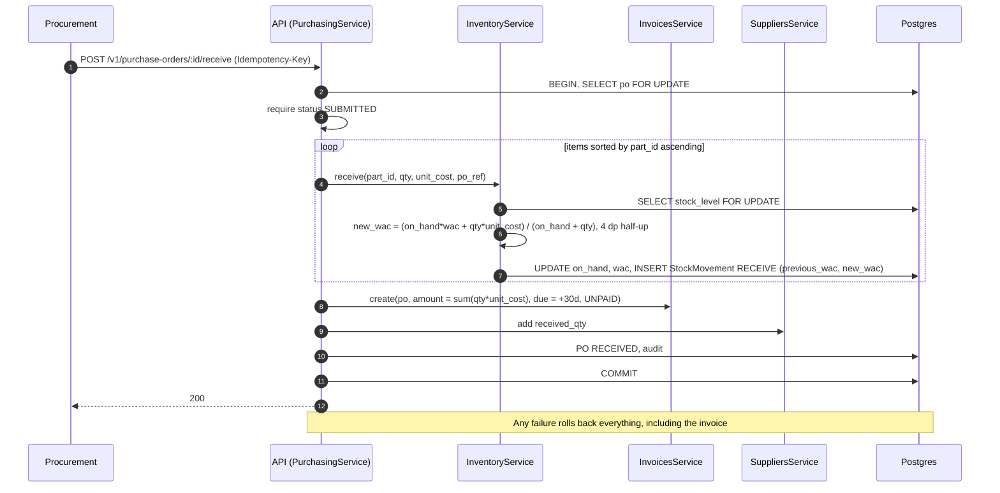
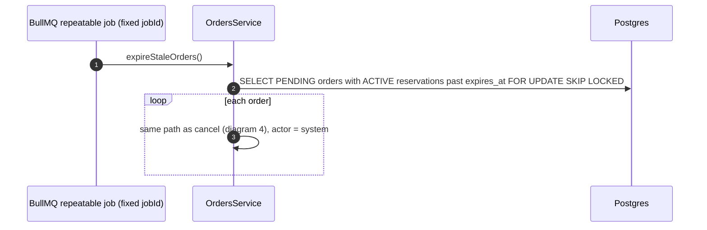

# Sequence diagrams (high-risk flows)

These are the flows where a mistake costs money, stock, or security. Each diagram is a contract: implementation and tests must match it. Decisions referenced: D4, D5, D8, D11.

## 1. Login and refresh rotation

Grace window: `REFRESH_GRACE_SECONDS=10` (env). It exists so two tabs refreshing at once do not look like token theft.

Per-request check: every authenticated request compares the JWT `token_version` with the user's current value (Redis cache, 30 s TTL, invalidated on bump). A mismatch returns 401.

## 2. Checkout with reservation

## 3. Pack: reservation becomes an issue

## 4. Cancel: release the reservation

## 5. Purchase order receipt

## 6. Reservation expiry job

